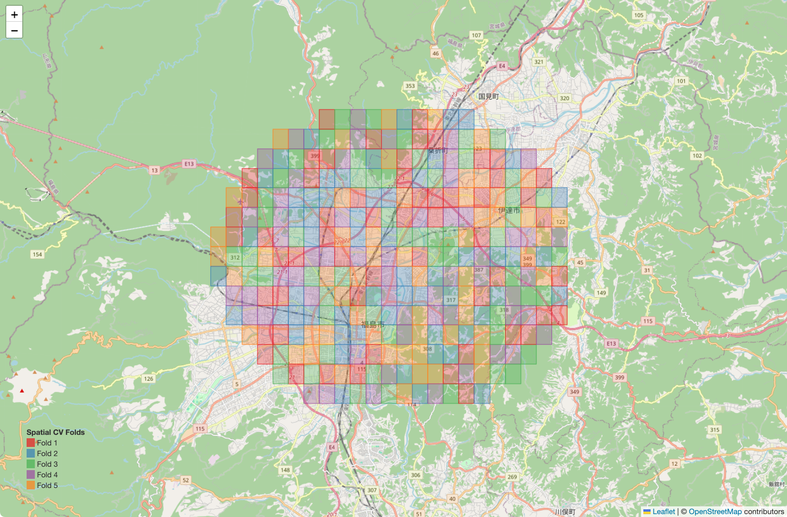
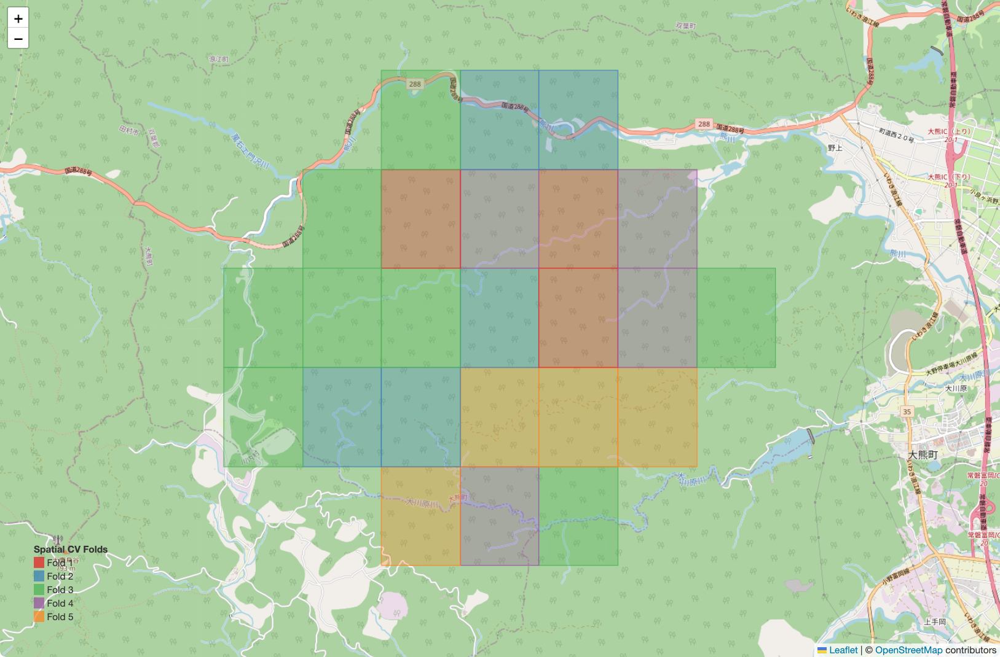

# GroupKFold

This directory contains a Python program that creates a SHAP summary plot
using a LightGBM regression model with GroupKFold cross-validation.

This program takes numerical data in CSV format as input and visualizes
the contribution of each explanatory variable to the target variable using
SHAP (SHapley Additive exPlanations).

---

## 1. System Requirements

- OS: macOS / Linux / Windows
- Python: **3.10.9 or later**
- Required Python packages:
  - lightgbm
  - scikit-learn
  - pandas
  - matplotlib

### Installation example

```bash
pip install lightgbm shap scikit-learn pandas matplotlib
```

## 2. Input Data

- Input format: CSV
- All explanatory variables must be numerical data
- The CSV file must contain exactly one target variable column

---

## 3. Available Datasets (GroupKFold)

### Data1 (Fukushima City and Date City)

- CSV: `date_2011-2017_landuse_geo.csv`
- Target variable: `crtR(2011:2017)`

### Data2 (National Route 288 in the Nogami region of Okuma Town)

- CSV: `nogami_200_2011-2022_onehot_geo.csv`
- Target variable: `crtR(2011:2022)`

### Data3 (National Route 288 in the Nogami region of Okuma Town)

- CSV: `nogami_200_2011-2022_continuous_geo.csv`
- Target variable: `crtR(2011:2022)`

---

## 4. Usage

### 4.1 Program Configuration

- Open `GroupKFold.py`.
- Modify **only** the following two user settings:
  - `file_path`
  - `target_variable`

#### Default setting (current program)
```
python(Data1)
# === User settings ===
file_path = "date_2011-2017_landuse_geo.csv"
target_variable = "crtR(2011:2017)"

python(Data2)
 === User settings ===
file_path = "nogami_200_2011-2022_onehot_geo.csv"
target_variable = "crtR(2011:2022)"

python(Data3)
 === User settings ===
file_path = "nogami_200_2011-2022_continuous_geo.csv"
target_variable = "crtR(2011:2022)"
```

The current program is set to (Data 1).
Please modify it as needed.

---

### 4.2 Execution Method

- In the terminal, execute the following command:

```bash
python GroupKFold.py
```


---

5. Output Results

The spatial cv folds map will be saved as an HTML file.

- python(Data1): Preview of the generated HTML file



- python(Data3): Preview of the generated HTML file




```python

```

