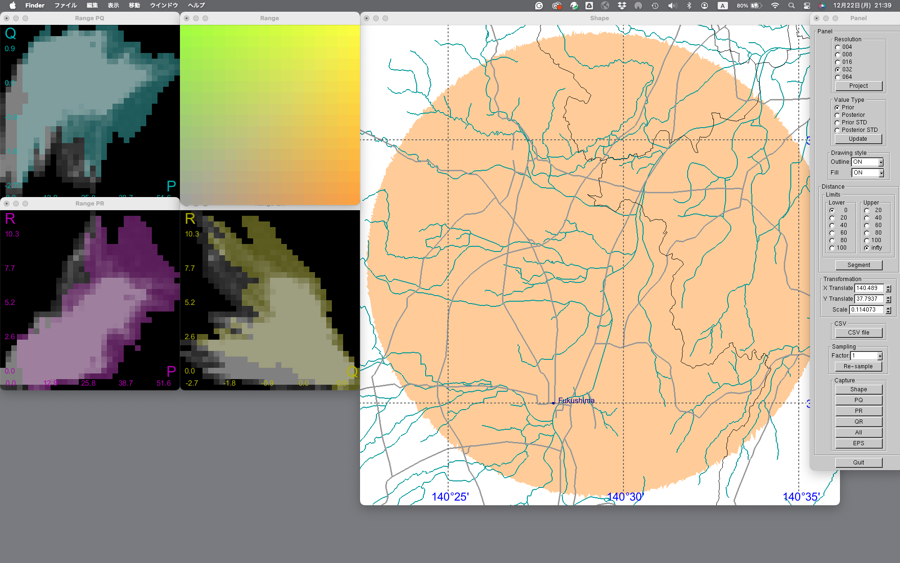
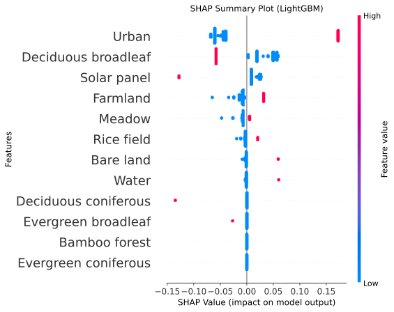
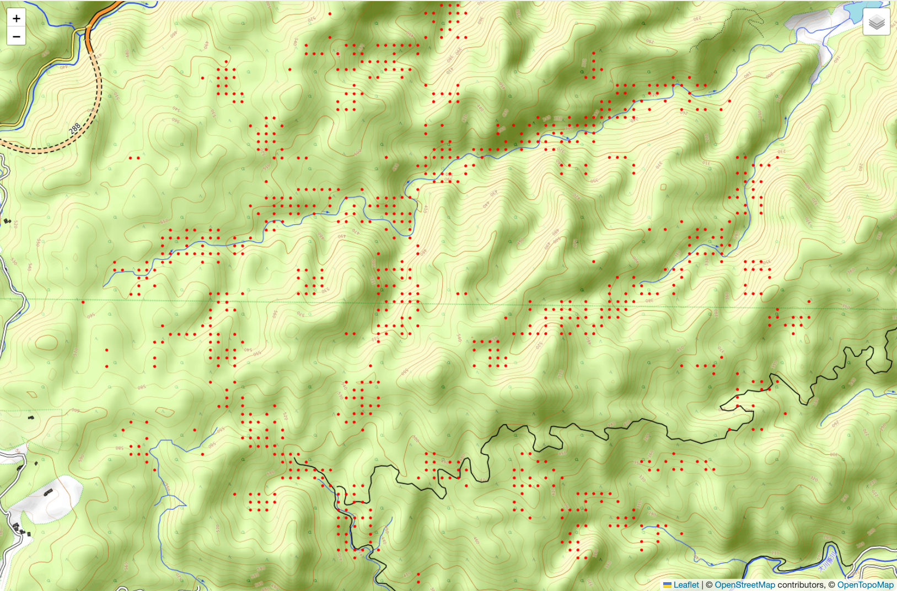

https://github.com/eyeviz/dose_rate_variation

This repository contains program packages for the work entitled

Ambient Dose Rate Variation in the Fukushima Region
Visualized Using Explainable AI Techniques

authored by 

Ryu Yoshida, Hiroshi Kurikami, Fumiya Nagao,
Shigeo Takahashi, and Yukihisa Sanada.

Note that this work is currently under review.

This repository contains five directories as follows:

- mapview/

This directory contains C++ program codes for visualizing
the ambient air dose rate and its reduction ratio on the map
in Fukushima Prefecture. The program loads the integrated
ambient dose rate map obtained through minotoring from 2011
to 2022, and compute the relevant dose rate reduction ratios
in terms of several important factors such as elevation,
distance from Fukushima Daiichi Nuclear Power Plant (FDNPP),
land use types, and terrain surface curvatures.

See mapview/README.md for more details

- SHAP/

This directory contains Python program codes for generating
SHAP summmary plots of the dose rate reduction ratio in
specific sample areas (Figures 4(b), 6(a), 6(c), and 8 in
the manuscript).

See SHAP/README.md for more details

- mapping/

This directory contains Python program codes for plotting
sample points on a geographic map by specifying beeswarm
points in the SHAP summary plot (Figure 6 in the manuscript).

See mapping/README.md for more details

- histogram/

This directory contains Python program codes for generating
histograms of the dose rate reduction ratio in specific
sample areas (Figures 5(b) and 7(c) in the manuscript).

See histogram/README.md for more details

- GroupKFold/

This directory offers Python program codes for conducting
the spatial (GroupKFold) cross-validation of the Light_GBM
based predictive model (Figure 10 in the manuscript).

See GroupKFold/README.md for more details

Datasets

We utilize several publicly available datasets in this program package. While the necessary data is included in the package to ensure the program is immediately usable, please refer to the data providers as needed.

- Integrated ambient dose rate map

Datasets of integrated radiation air dose rate maps over the 80 km radius of the Fukushima Daiichi Nuclear Power Plant and the entire Fukushima Prefecture during 2011–2022:

https://doi.org/10.60427/0002000022

Sakuma, K., Kurikami, H., Wainwright, H., Tanimori, S., Nagao, F., Ochi, K., Sanada, Y., Saito, K., 2024. Integrated radiation air dose rate maps over the 80 km radius of the Fukushima Daiichi Nuclear Power Plant and the entire Fukushima Prefecture during 2011–2024. J. Environ. Radioact. 280, 107554. https://doi.org/10.1016/j.jenvrad.2024.107554.

- Geographic data (elevation, road networks, river networks, and administrative boundaries (e.g., municipalities))

National Land Numerical Information Download Site:

https://nlftp.mlit.go.jp/ksj/

- Land use data:

High-Resolution Land Use and Land Cover Map Products by JAXA:

https://earth.jaxa.jp/en/data/2562/index.html

Takahashi, M., Nasahara, K.N., Tadano, T., Watanabe, T., Dotsu, M., Sugimura, T., 2013. JAXA high resolution land-use and land-cover map of Japan. In Proceedings of the 2013 IEEE International Geoscience and Remote Sensing Symposium – IGARSS. 2384–2387. https://doi.org/10.1109/IGARSS.2013.6723299

