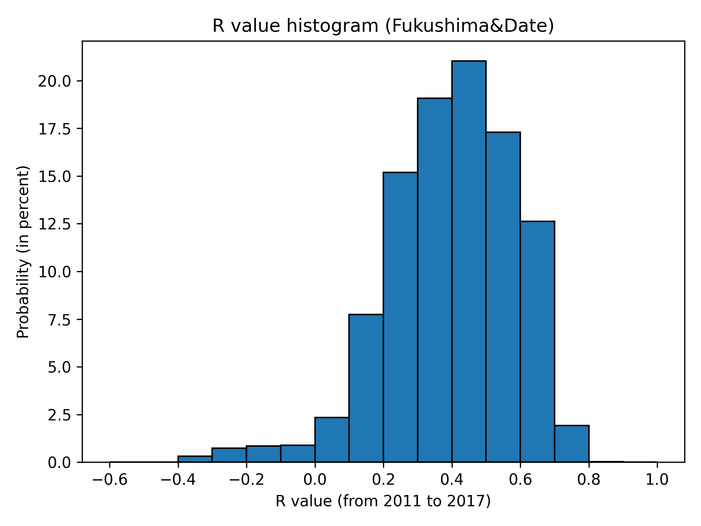

https://github.com/eyeviz/dose_rate_variation

This repository contains program packages for the work entitled

Ambient Dose Rate Variation in the Fukushima Region
Visualized Using Explainable AI Techniques

authored by 

Ryu Yoshida, Hiroshi Kurikami, Fumiya Nagao,
Shigeo Takahashi, and Yukihisa Sanada.

This repository contains two directories as follows:

mapview/

This directory contains C++ program codes for visualizing
the ambient air dose rate and its reduction ratio on the map
in Fukushima Prefecture. The program loads the integrated
ambient dose rate map obtained through minotoring from 2011
to 2022, and compute the relevant dose rate reduction ratios
in terms of several important factors such as elevation,
distance from Fukushima Daiichi Nuclear Power Plant (FDNPP),
land use types, and terrain surface curvatures.

See mapview/README.md for more details

??????/

See ??????/README.md for more details

histogram/

This directory contains Python program codes for generating
histograms of the air dose reduction ratio in specific
sample areas (Figures 5(b) and 7(c)).

See histogram/README.md for more details

