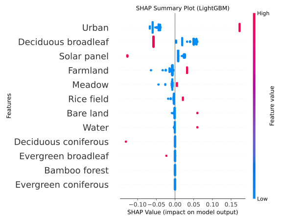
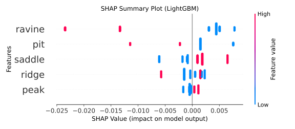
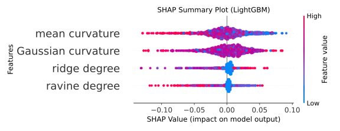

SHAP

This directory contains a Python program that creates a SHAP summary plot using a LightGBM regression model.

This program takes numerical data in CSV format as input and visualizes the contribution of each explanatory variable to the target variable using SHAP (SHapley Additive exPlanations).

---

 1. System Requirements

- OS: macOS / Linux / Windows
- Python: **3.10.9 or later**
- Required Python Packages:
  - lightgbm
  - shap
  - scikit-learn
  - pandas
  - matplotlib

Installation Example

pip install lightgbm shap scikit-learn pandas matplotlib

---


 2. Input Data

- Input format: CSV
- All explanatory variables must be numerical data
- Must contain one column for the target variable

---

 3. Available Datasets
Please download the data files from the ‘Data File’ section into the same directory as ‘SHAP.py’.

 Data1 (Fukushima City and Date City)
- CSV：`date_2011_2017_landuse.csv`
- Target variable：`crtR(2011:2017)`

 Data2 (National Route 288 in the Nogami region of Okuma Town)
- CSV：`new_sourth_200_onehot.csv`
- Target variable：`crtR(2011:2022)`

 Data3 (National Route 288 in the Nogami region of Okuma Town. SHAP summary plot for the dose reduction ratio determined using continuous explanatory variables (mean curvature, Gaussian curvature, ridge degree, and valley degree) in the LightGBM predictive models.)
- CSV：`new_sourth_200_continuous.csv`
- Target variable：`crtR(2011:2022)`

---

 4. Usage

4.1 Program Configuration

Open ‘SHAP.py’ and modify the following user configuration sections according to the dataset you are using.

```
python(Data1)
 === User settings ===
file_path = "date_2011-2017_landuse.csv"
target_variable = "crtR(2011:2017)"

python(Data2)
 === User settings ===
file_path = "nogami_200_2011-2022_onehot.csv"
target_variable = "crtR(2011:2022)"

python(Data3)
 === User settings ===
file_path = "nogami_200_2011-2022_continuous.csv"
target_variable = "crtR(2011:2022)"
```

The current program is set to (Data 1).
Please modify it as needed.

 4.2 Execution Method

- In the terminal, execute the following command:

```bash
python SHAP.py
```

---

5. Output Results

- The SHAP summary plot will be output as an image file.


- python(Data1)



- python(Data2)



- python(Data3)




```python

```
