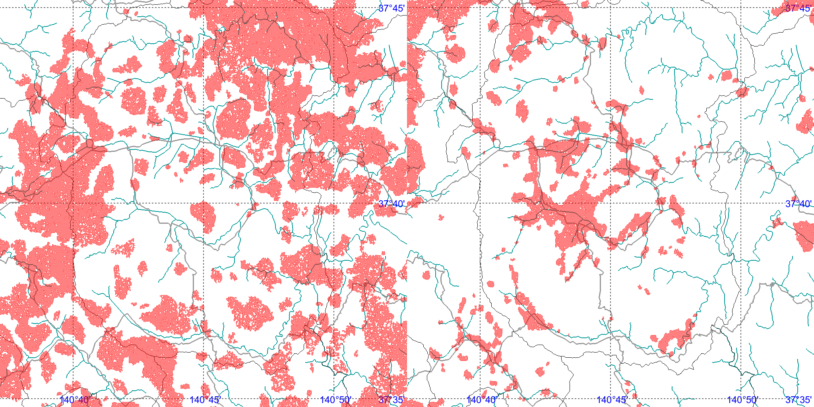
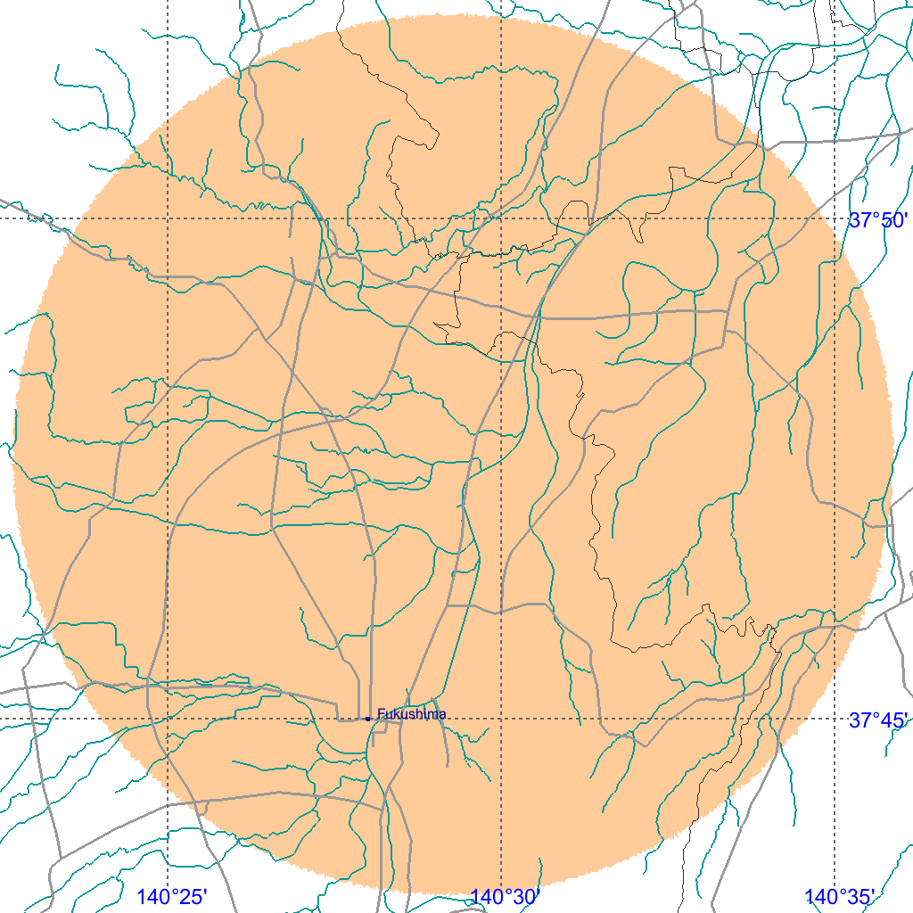
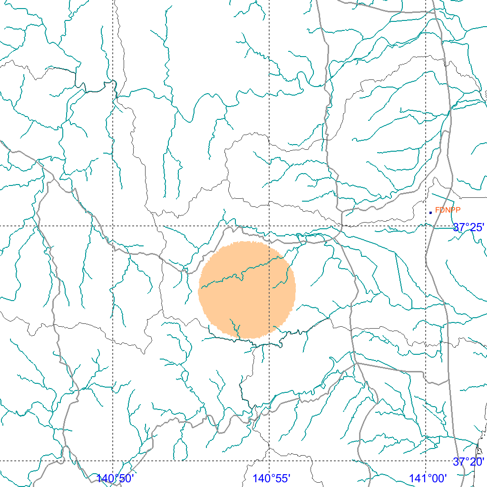

This program package is prepared on the MacOS platform.  The
codes can be compiled with any Unix OS platform such as
Linux OS through minor revision fo the Makefile.

The program package uses OpenCV, Eigen3, FTGL libraries.
You can install these packages with HomeBrew as
> brew install opencv
> brew install eigen
> brew install ftgl

Overall, you can compile the program as follows:

> make depend
> make
> ./mapview

Unpack the data files
> unzip JAEA_niida_integrated_map_040.zip
> unzip JAEA_date_integrated_map_050.zip
> unzip JAEA_nogami_integrated_map_040.zip

For example, you can visualize the case study of the area
around the Niida River (Section 3.1) by
> ./fltrview -c configs/niida-attenuation.conf

The case study of the area in Fukushima City and Date City
in Fukushima Prefecture can be obtained by
> ./fltrview -c configs/date-attenuation.conf

You can also analyze the case study of the national forest south of the National Route 288 in Nogame area of Okuma Town by  
> ./fltrview -c configs/nogami-attenuation.conf

Note that once the program load the data from the ascii
file, it transforms the data into binary format and wrote
the binary file. Next time, the program directly load the
binary data file and thus you can accelerate the
initialization.

